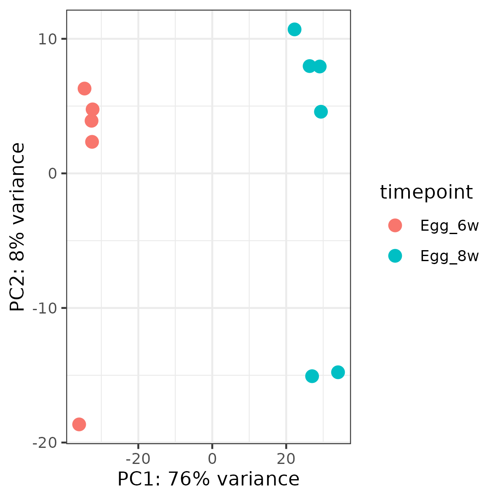
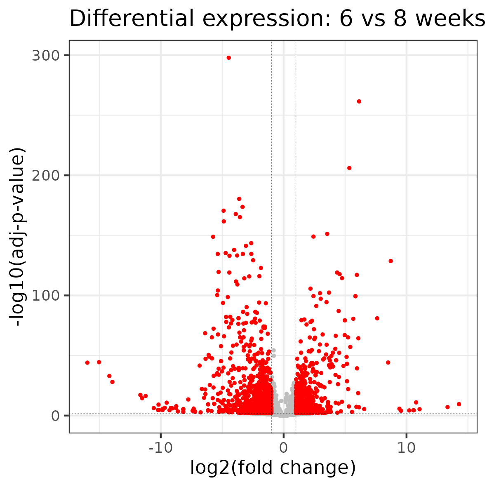
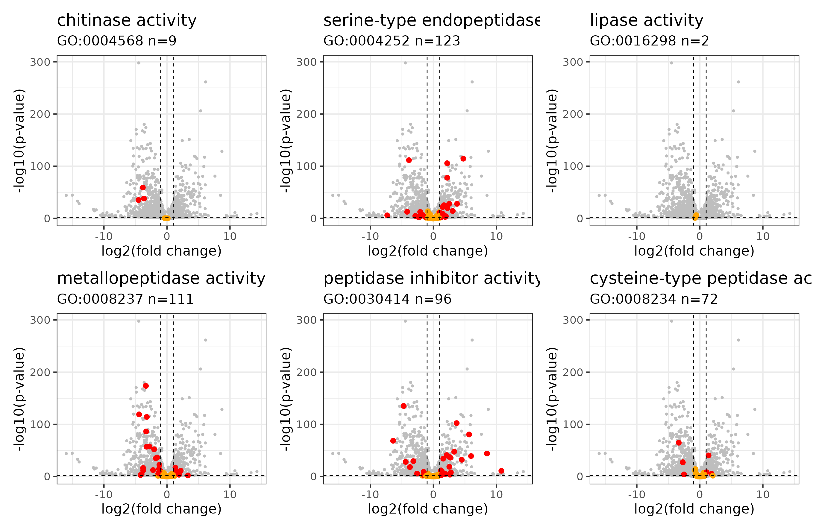
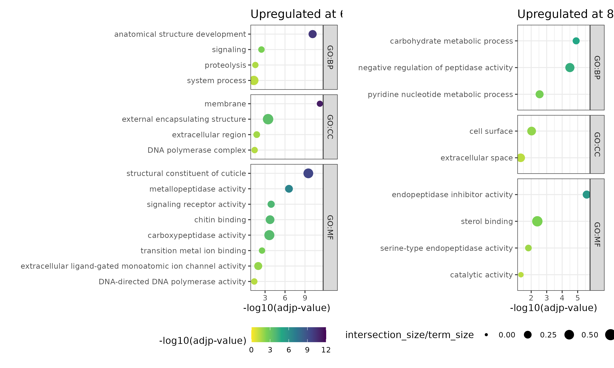

# RNAseq analysis of Trichuris muris hatching 

- Steve Doyle and Paul Airs


## Sample metadata and lane IDs

| Sample_name | Sanger_sample_ID | Time    | Replicate | Lane ID 1  | Lane ID 2  | Study | Study_accession |
|-------------|------------------|---------|-----------|------------|------------|-------|-----------------|
| 6W1         | 6035STDY8620659  | 6_weeks | 1         | 32620_7_1  | 32377_6_1  | 6035  | ERP118415       |
| 6W2         | 6035STDY8620660  | 6_weeks | 2         | 32620_7_2  | 32377_6_2  | 6035  | ERP118415       |
| 6W3         | 6035STDY8620661  | 6_weeks | 3         | 32620_7_3  | 32377_6_3  | 6035  | ERP118415       |
| 6W4         | 6035STDY8620662  | 6_weeks | 4         | 32620_7_4  | 32377_6_4  | 6035  | ERP118415       |
| 6W5         | 6035STDY8620663  | 6_weeks | 5         | 32620_7_5  | 32377_6_5  | 6035  | ERP118415       |
| 8W1         | 6035STDY8620664  | 8_weeks | 1         | 32620_7_6  | 32377_6_6  | 6035  | ERP118415       |
| 8W2         | 6035STDY8620665  | 8_weeks | 2         | 32620_7_7  | 32377_6_7  | 6035  | ERP118415       |
| 8W3         | 6035STDY8620666  | 8_weeks | 3         | 32620_7_8  | 32377_6_8  | 6035  | ERP118415       |
| 8W4         | 6035STDY8620667  | 8_weeks | 4         | 32620_7_9  | 32377_6_9  | 6035  | ERP118415       |
| 8W5         | 6035STDY8620668  | 8_weeks | 5         | 32620_7_10 | 32377_6_10 | 6035  | ERP118415       |
| 8W6         | 6035STDY8620669  | 8_weeks | 6         | 32620_7_11 | 32377_6_11 | 6035  | ERP118415       |


## Get the raw data
```bash
module load irods_extractor/v3.2.0

irods_extractor --studyid 6035 --runid 32620

irods_extractor --studyid 6035 --runid 32377


imeta -z seq qu -d study_id = 6035

ils | grep 32620_7 | grep "cram" | grep -v "phix" | grep -v "crai" | sed 's/ //g' | while read -r ID; do echo "iget ${ID}"; done

ils | grep "32377_6" | grep "cram" | grep -v "phix" | grep -v "crai" | sed 's/ //g' | while read -r ID; do echo "iget ${ID}"; done
```


## QC the raw data
```bash

bsub.py 10 fqc ~sd21/bash_scripts/run_fastqc

```


## Running Kallisto
```bash
# load kallisto
module load kallisto/0.46.2--h4f7b962_1

# Kalliso starts by building and index, using the Trichuris music transcripts file which we pull with wget. Check if names update over time!
if test -f  trichuris_muris.PRJEB126.WBPS18.mRNA_transcripts.fa.gz; 
then echo "Transcriptome already downloaded - proceeding"
else wget https://ftp.ebi.ac.uk/pub/databases/wormbase/parasite/releases/WBPS18/species/trichuris_muris/PRJEB126/trichuris_muris.PRJEB126.WBPS18.mRNA_transcripts.fa.gz
fi

# If index file does not exist yet then we make one
if test -f Tmuris_transcripts.idx;
then echo "Transcript index already built - proceeding"
else kallisto index -i Tmuris_transcripts.idx trichuris_muris.PRJEB126.WBPS18.mRNA_transcripts.fa.gz
fi


#This loop runs through samples line by line (-1) with _1.fastq.gz in the name, and sed removed the '_1.fastq.gz.
#While read statement loops kallisto, which requires the transcripts.idx index made previously above.
#Outputs to head node folder 

if [ -z "$(ls -A /nfs/users/nfs_p/pa16/Hatching_RNAseq/KallistoOutputs)" ]; then
	echo "Starting Kallisto Run" |
	cd /nfs/users/nfs_p/pa16/lustre_link/HATCHING/RAW_DATA |
    while read SAMPLE LANE1 LANE2; do
    kallisto quant -i /nfs/users/nfs_p/pa16/Hatching_RNAseq/Tmuris_transcripts.idx -o /nfs/users/nfs_p/pa16/Hatching_RNAseq/KallistoOutputs/${SAMPLE} -b 100 ${LANE1}_1.fastq.gz ${LANE1}_2.fastq.gz ${LANE2}_1.fastq.gz ${LANE2}_2.fastq.gz;
    done < samples_lane1_lane2.txt
else
	echo "Files Exist, check to see if Kallisto results present"
fi

```


## DEseq2 from Kallisto outputs
```R
# install packages if needed
if (!require("BiocManager", quietly = TRUE))
  install.packages("BiocManager")

BiocManager::install("DESeq2")
BiocManager::install("rhdf5")
BiocManager::install("tximportData")
BiocManager::install("devtools")    # only if devtools not yet installed
BiocManager::install("biomaRt")
BiocManager::install("limma")
BiocManager::install("AnnotationHub")
BiocManager::install('apeglm')
BiocManager::install('EnhancedVolcano')

# load libraries
library(biomaRt)
library(rhdf5)
library(tximport)
library(DESeq2)
library(tidyverse)
library(patchwork)
library(ggrepel)


# read in some sample information
setwd("~/lustre_link/trichuris_muris/HATCHING")
sampleinfo <- read.csv("KallistoOutputs/SampleInfo.csv")
sampleinfo$timepoint <- as.factor(sampleinfo$timepoint)
sampleinfo$time_sample <- as.factor(sampleinfo$time_sample)

#read kallisto files
files <- file.path("KallistoOutputs", sampleinfo$time_sample, "abundance.h5")
files <- set_names(files, sampleinfo$SampleName)

# import kallisto files
txi <- tximport(files, type = "kallisto", txOut = TRUE)


# set up the model 
simple.model <- as.formula(~ timepoint)

# because of alphabetical assignment our beta 0 / 1 are the wrong way around
sampleinfo <- mutate(sampleinfo, timepoint = fct_relevel(timepoint, "Egg_6w"))
#model.matrix(simple.model, data = sampleinfo)
#cbind(sampleinfo, model.matrix(simple.model, data = sampleinfo))


# Import the things into DESEq2 ----
ddsObj.raw <- DESeqDataSetFromTximport(txi = txi,
                                       colData  = sampleinfo,
                                       design = ~ timepoint)
# subset the low count genes ----
keep <- rowSums(counts(ddsObj.raw)) > 1 
ddsObj.filt <- ddsObj.raw[keep ,  ]

# DESeq2 Manual ----
ddsObj <- DESeq(ddsObj.filt)


# estimate size factors ----
ddsObj <- estimateSizeFactors(ddsObj)

#res <- results(ddsObj, name="timepoint_Egg_8w_vs_Egg_6w")
#res <- results(ddsObj, contrast=c("timepoint", "Egg_6w","Egg_8w"))


# because we are interested in 6W vs 8W, we set 'coef=2'
resApe <- lfcShrink(ddsObj, coef=2, type="apeglm")
#resNorm <- lfcShrink(ddsObj, coef=2, type="normal")
#resAsh <- lfcShrink(ddsObj, coef=2, type="ashr")


```


## PCA

```R
## Make PCA
deseq2VST <- vst(ddsObj, blind = T)

pcaData <- plotPCA(deseq2VST, intgroup=c("timepoint"), returnData=TRUE)

pcaData <- plotPCA(ddsObj, intgroup=c("timepoint"), returnData=TRUE)

percentVar <- round(100 * attr(pcaData, "percentVar"))

plot_PCA <- ggplot(pcaData, aes(PC1, PC2, color=timepoint)) +
  geom_point(size=3) +
  xlab(paste0("PC1: ",percentVar[1],"% variance")) +
  ylab(paste0("PC2: ",percentVar[2],"% variance")) +
  theme_bw()

plot_PCA

ggsave("hatching_PCA_6v8w.pdf", height=100, width=100, units="mm")
ggsave("hatching_PCA_6v8w.png", height=100, width=100, units="mm")
```



## Volcano plots of resApe, resNorm, and resAsh
```R
p_threshold=0.01
fc_threshold=1

de_data <- as.data.frame(resApe)
de_data <- rownames_to_column(de_data, "Target_ID")
de_data.filt <- filter(de_data, log2FoldChange > 1 | log2FoldChange < -1, padj <  p_threshold)

plot_volcano_6v8 <- ggplot() + 
      geom_point(aes(de_data$log2FoldChange, -log10(de_data$padj)), size=0.5, colour = "grey") +
      geom_point(aes(de_data.filt$log2FoldChange, -log10(de_data.filt$padj)), colour="red", size=0.5) +
      labs(title="Differential expression: 6 vs 8 weeks", y="-log10(adj-p-value)", x="log2(fold change)") +
      geom_hline(yintercept=-log10(p_threshold), linetype = "dashed", linewidth=0.1) +
      geom_vline(xintercept=c(fc_threshold, -1*fc_threshold), linetype = "dashed", linewidth=0.1) + 
      theme_bw()

plot_volcano_6v8

ggsave("hatching_de_genes_all.pdf", height=100, width=100, units="mm")
ggsave("hatching_de_genes_all.png", height=100, width=100, units="mm")

write.csv(as.data.frame(de_data), file="hatching_RNAseq_DE_6v8eggs_all-transcripts.csv", row.names = FALSE, quote=FALSE)
```



## Stats on differentially expressed genes
```R
# number of differental expressed genes - total
de_data.filt <- filter(de_data, log2FoldChange > 1 | log2FoldChange < -1, padj <  0.01)

> nrow(de_data.filt)
[1] 2027


# number of differental expressed genes - upregulated at 6 weeks
hatching_de_genes_all_sig0.01_fcltminus1 <- filter(de_data, log2FoldChange < -1, padj <  0.01)

de_data.filt %>% filter(log2FoldChange < -1) %>% nrow()
[1] 1171

write.csv(as.data.frame(hatching_de_genes_all_sig0.01_fcltminus1), file="hatching_de_genes_all_sig0.01_fcltminus1.csv", row.names = FALSE, quote=FALSE)


# number of differental expressed genes - upregulated at 8 weeks
hatching_de_genes_all_sig0.01_fcgt1 <- filter(de_data, log2FoldChange > 1, padj <  0.01)

> de_data.filt %>% filter(log2FoldChange > 1) %>% nrow()
[1] 856

write.csv(as.data.frame(hatching_de_genes_all_sig0.01_fcgt1), file="hatching_de_genes_all_sig0.01_fcgt1.csv", row.names = FALSE, quote=FALSE)

```


## Make volcano plots per GOterm
- GO:0004568    chitinase activity
- GO:0004867	serine-type endopeptidase inhibitor activity
- GO:0004252	serine-type endopeptidase activity
- GO:0008237	metallopeptidase activity
- GO:0008234	cysteine-type peptidase activity
- GO:0008233	peptidase activity
- GO:0030414	peptidase inhibitor activity  
- GO:0016298    lipase activity

```R
plot_GO_volcanos <- function(GOterm, name) {
  # Load required libraries
  library(dplyr)
  library(fuzzyjoin)
  library(ggplot2)
  library(tibble)
  
  fc_threshold=1
  p_threshold=0.01
  
  # Read data files
  goterms <- read.delim("mart_export.txt", sep="\t", header=TRUE)
  merops <- read.delim("MEROPS_annotated.csv", sep=",", header=TRUE)
  
  # Filter the data for the given GO term
  filtered_go_transcript_ids <- filter(goterms, GO.term.accession == GOterm) %>% 
    select(Transcript.stable.ID)
  
  # Join the expression data with filtered GO term data
  filtered_go_transcript_expr <- inner_join(de_data, filtered_go_transcript_ids, by = c("Target_ID" = "Transcript.stable.ID"))
  
  # Perform fuzzy join with MEROPS data
  filtered_go_transcript_expr <- filtered_go_transcript_expr %>% 
    fuzzy_left_join(merops, by = c("Target_ID" = "Gene_ID"), match_fun = str_detect)
  
  # Convert the results to a data frame and add row names as a column
  de_data <- as.data.frame(resApe)
  de_data <- rownames_to_column(de_data, "Target_ID")
  
  # Filter the expression data based on fold change and adjusted p-value thresholds
  de_data.filt <- filter(de_data, log2FoldChange > fc_threshold | log2FoldChange < -fc_threshold, padj <  p_threshold)
  
  # Create the volcano plot
  plot <- ggplot() + 
    # All data points in grey
    geom_point(data = de_data, aes(x = log2FoldChange, y = -log10(padj)), size = 0.5, colour = "grey") +
    
    # Highlighted points for significant genes
    geom_point(data = filtered_go_transcript_expr, 
               aes(x = log2FoldChange, y = -log10(padj), 
                   colour = (padj < 0.01 & log2FoldChange > 1) | (padj < 0.01 & log2FoldChange < -1)), 
               size = 1.5) +
    
    # Horizontal and vertical threshold lines
    geom_hline(yintercept = -log10(p_threshold), linetype = "dashed", linewidth = 0.3) +
    geom_vline(xintercept = c(fc_threshold, -fc_threshold), linetype = "dashed", linewidth = 0.3) + 
    
    # Custom color scale
    scale_colour_manual(values = c("TRUE" = "red", "FALSE" = "orange")) +
    
    # Labels and theme
    labs(title = name, 
         subtitle = paste0(GOterm, " n=", nrow(filtered_go_transcript_expr)), 
         y = "-log10(p-value)", x = "log2(fold change)") +
    theme_bw() + 
    theme(legend.position = "none")
  
  # Save the plot to a file
  #ggsave(filename = paste0(name, "_volcano_plot.png"), plot = plot, width = 8, height = 6)
  
  return(plot)
}


  
  
  #GO:0004568 - chitinase activity
  #GO:0004867	serine-type endopeptidase inhibitor activity
  #GO:0004252	serine-type endopeptidase activity
  # GO:0008237	metallopeptidase activity
  # GO:0008234	cysteine-type peptidase activity
  # GO:0008233	peptidase activity
  # GO:0030414	peptidase inhibitor activity  
  # GO:0016298  lipase activity


plot_serine <- plot_GO_volcanos("GO:0004252", "serine-type endopeptidase activity")
plot_chitinase <- plot_GO_volcanos("GO:0004568", "chitinase activity") # chitinase activity
plot_cysteine <- plot_GO_volcanos("GO:0008234", "cysteine-type peptidase activity")
plot_metallo <- plot_GO_volcanos("GO:0008237", "metallopeptidase activity")
plot_lipase <- plot_GO_volcanos("GO:0016298", "lipase activity")
plot_pep_inhibitors <- plot_GO_volcanos("GO:0030414", "peptidase inhibitor activity")


( plot_chitinase +  plot_serine + plot_lipase) / (plot_metallo  + plot_pep_inhibitors  + plot_cysteine) 


ggsave("hatching_de_genes_goterms_3x2.pdf", height=150, width=230, units="mm")
ggsave("hatching_de_genes_goterms_3x2.png", height=150, width=230, units="mm")
```



```R
make_GO_tables <- function(GOterm, name){
  # Load required libraries
  library(dplyr)
  library(fuzzyjoin)
  library(ggplot2)
  library(tibble)


  de_data <- as.data.frame(resApe)
 de_data <- rownames_to_column(de_data, "Target_ID")

 # Read data files
  goterms <- read.delim("mart_export.txt", sep="\t", header=TRUE)
  merops <- read.delim("MEROPS_annotated.csv", sep=",", header=TRUE)
  
  # Filter the data for the given GO term
  filtered_go_transcript_ids <- filter(goterms, GO.term.accession == GOterm) %>% 
    select(Transcript.stable.ID)
  
  # Join the expression data with filtered GO term data
  filtered_go_transcript_expr <- inner_join(de_data, filtered_go_transcript_ids, by = c("Target_ID" = "Transcript.stable.ID"))
  

  # Perform fuzzy join with MEROPS data
  filtered_go_transcript_expr_mer <- filtered_go_transcript_expr %>% 
    fuzzy_left_join(merops, by = c("Target_ID" = "Gene_ID"), match_fun = str_detect)

filtered_go_transcript_expr_mer

write.csv(as.data.frame(filtered_go_transcript_expr_mer), file= paste0(name, "_DE_per_GOterm_data.csv"), row.names = FALSE, quote=FALSE)

up_6w <- filtered_go_transcript_expr %>% filter(log2FoldChange < -1 & padj < 0.01) %>% nrow()

print(up_6w)


up_8w <- filtered_go_transcript_expr %>% filter(log2FoldChange > 1 & padj < 0.01) %>% nrow()

print(up_8w)
}


  #GO:0004568 - chitinase activity
  #GO:0004867	serine-type endopeptidase inhibitor activity
  #GO:0004252	serine-type endopeptidase activity
  # GO:0008237	metallopeptidase activity
  # GO:0008234	cysteine-type peptidase activity
  # GO:0008233	peptidase activity
  # GO:0030414	peptidase inhibitor activity  
  # GO:0016298  lipase activity


make_GO_tables("GO:0004252", "serine-type_endopeptidase_activity")
[1] 9
[1] 17


make_GO_tables("GO:0004568", "chitinase_activity") # chitinase activity
[1] 3
[1] 0

make_GO_tables("GO:0008234", "cysteine-type_peptidase_activity")
[1] 3
[1] 3

make_GO_tables("GO:0008237", "metallopeptidase_activity")
[1] 25
[1] 6


make_GO_tables("GO:0016298", "lipase_activity")

[1] 0
[1] 0

make_GO_tables("GO:0030414", "peptidase_inhibitor_activity")
[1] 9
[1] 21
```


## Plot gProfiler results
```R
data_6w <- read.delim("gprofiler_6week.txt")
# https://biit.cs.ut.ee/gplink/l/TyiRF6NkQ8

data_8w <- read.delim("gprofiler_8week.txt")
# https://biit.cs.ut.ee/gplink/l/GkYjEdMISw 

data_6w_filter <- data_6w %>% filter(highlighted == "TRUE")
data8w_filter <- data_8w %>% filter(highlighted == "TRUE")

plot_gp_6w <- ggplot(data_6w_filter) + 
  geom_point(aes(negative_log10_of_adjusted_p_value, reorder(term_name, negative_log10_of_adjusted_p_value), size=intersection_size/term_size, colour=negative_log10_of_adjusted_p_value)) + 
  facet_grid(source ~ ., scales = "free", space = "free") +
  scale_size(limits=c(0,1)) +
  scale_colour_viridis_c(direction=-1, limits=c(0,12)) +
  theme_bw() + labs(title="Upregulated at 6 weeks", y="", colour= "-log10(adjp-value)", x="-log10(adjp-value)")

plot_gp_8w <- ggplot(data8w_filter) + 
  geom_point(aes(negative_log10_of_adjusted_p_value, reorder(term_name, negative_log10_of_adjusted_p_value), size=intersection_size/term_size, colour=negative_log10_of_adjusted_p_value)) + 
  facet_grid(source ~ ., scales = "free", space = "free") +
  scale_size(limits=c(0,1))+
  scale_colour_viridis_c(direction=-1, limits=c(0,12)) +
  theme_bw() + labs(title="Upregulated at 8 weeks", y="", colour= "-log10(adjp-value)", x="-log10(adjp-value)")

plot_gp_6w + plot_gp_8w + plot_layout(ncol=2, guides = "collect") & theme(legend.position = 'bottom')

ggsave("gene_set_enrichment_6v8weeks.pdf", height=150, width=250, units="mm")
ggsave("gene_set_enrichment_6v8weeks.png", height=150, width=250, units="mm")
```



##########################################################
############GO terms curated #############################
##########################################################

mart <- useMart("parasite_mart", dataset = "wbps_gene", host = "https://parasite.wormbase.org", port = 443)
genes <- getBM(mart = mart, filters = "species_id_1010", 
               value = "trmuriprjeb126", 
               attributes = c("wbps_gene_id", "wbps_transcript_id", "external_gene_id", "go_name_1006"))
genes <- dplyr::rename(genes, target_id = wbps_transcript_id,
                       ens_gene = wbps_gene_id, ext_gene = external_gene_id, go_name = go_name_1006)
res.dat <- as.data.frame(resApe)
res.dat <- rownames_to_column(res.dat, "Target_ID")
res.GO <- full_join(genes, res.dat, by = join_by(target_id == Target_ID))
res.GO.list <- filter(res.GO, log2FoldChange > 1 | log2FoldChange < 1, padj <  0.01)
write.csv(res.GO.list, "res_GO.csv")
#res.GO.list <- filter(res.GO, log2FoldChange > 0.5 | log2FoldChange < 0.5, padj <  10e-32)
res.GO.list <- distinct(res.GO.list, target_id, log2FoldChange, padj)


res.GO.extracellular <- filter(res.GO, go_name == "extracellular region")
EnhancedVolcano(res.GO.extracellular,
                lab = res.GO.extracellular$target_id,
                x = 'log2FoldChange',
                y = 'pvalue',
                title = 'Volcano - GO - Extracellular',
                pCutoff = 10e-32,
                FCcutoff = 0.5,
                pointSize = 3.0,
                labSize = 1.0,
                drawConnectors = TRUE,
                widthConnectors = 0.5)


res.GO.serineinhibitor <- filter(res.GO, go_name == "serine-type endopeptidase inhibitor activity")
EnhancedVolcano(res.GO.serineinhibitor,
                lab = res.GO.serineinhibitor$target_id,
                x = 'log2FoldChange',
                y = 'pvalue',
                title = 'Volcano - global',
                pCutoff = 10e-32,
                FCcutoff = 0.5,
                pointSize = 3.0,
                labSize = 1.0,
                drawConnectors = TRUE,
                widthConnectors = 0.5)

res.GO.serineinhibitor <- filter(res.GO, go_name == "serine-type endopeptidase inhibitor activity")
EnhancedVolcano(res.GO.serineinhibitor,
                lab = res.GO.serineinhibitor$target_id,
                x = 'log2FoldChange',
                y = 'pvalue',
                title = 'Volcano - global',
                pCutoff = 10e-32,
                FCcutoff = 0.5,
                pointSize = 3.0,
                labSize = 1.0,
                drawConnectors = TRUE,
                widthConnectors = 0.5)


##########################################################
############Eichenburger secretome proteins ##############
##########################################################

res.dat <- as.data.frame(resNorm)
res.dat <- rownames_to_column(res.dat, "Target_ID")

genes_and_transcripts <- arrange(genes, target_id, ext_gene)
genes_and_transcripts <- distinct(genes_and_transcripts, target_id, ext_gene)

setwd("/Volumes/duque_correa/csci_duque_correa/Paul/Hatching_RNAseq")
library(readxl)
Other_names_Tmuris <- read_excel("MEROPS/Other_names_Tmuris.xlsx")
Other_names_Tmuris <- distinct(Other_names_Tmuris, New, Old)

Eichenberger_proteins <- read_csv("Eichenberger_proteins.csv")
Eichenberger_proteins <- Eichenberger_proteins %>%
  inner_join(Other_names_Tmuris, by = join_by(Secreted == Old), keep = FALSE)

Secreted <- left_join(Eichenberger_proteins, genes_and_transcripts, by = join_by(New == ext_gene))
Secreted <- Secreted[,2:4]

res.Secreted <-  full_join(Secreted, res.dat, by = join_by(target_id == Target_ID))
res.Secreted.minimal <-  left_join(Secreted, res.dat, by = join_by(target_id == Target_ID))
res.Secreted$Presence <- !is.na(res.Secreted$New) & res.Secreted$New != ""

EnhancedVolcano(res.Secreted.minimal,
                lab = res.Secreted.minimal$target_id,
                x = 'log2FoldChange',
                y = 'pvalue',
                title = 'Secreted - curated types',
                pCutoff = 10e-32,
                FCcutoff = 0.5,
                pointSize = 3.0,
                labSize = 1.0,
                drawConnectors = TRUE,
                widthConnectors = 0.75)

# create custom key-value pairs for 'high', 'low', 'mid' expression by fold-change
# this can be achieved with nested ifelse statements

# create custom key-value pairs for 'high', 'low', 'mid' expression by fold-change
# this can be achieved with nested ifelse statements
keyvals <- ifelse(
  res.Secreted$Presence == TRUE,'red', 'grey')

names(keyvals)[keyvals == 'grey'] <- 'Absent'
names(keyvals)[keyvals == 'red'] <- 'Present'

EnhancedVolcano(res.Secreted,
                lab = res.Secreted$New,
                x = 'log2FoldChange',
                y = 'pvalue',
                selectLab = res.Secreted$New[which(names(keyvals) %in% c('Present'))],
                xlab = bquote(~Log[2]~ 'fold change'),
                title = 'Custom colour over-ride',
                pCutoff = 10e-32,
                FCcutoff = 0.5,
                pointSize = 3,
                labSize = 1,
                shape = c(16, 16, 16, 16),
                colCustom = keyvals,
                colAlpha = 1,
                legendPosition = 'left',
                legendLabSize = 15,
                legendIconSize = 5.0,
                drawConnectors = TRUE,
                widthConnectors = 0.5,
                colConnectors = 'black',
                arrowheads = FALSE,
                gridlines.major = TRUE,
                gridlines.minor = FALSE,
                border = 'partial',
                borderWidth = 1.5,
                borderColour = 'black')

res.Secreted.list <- filter(res.Secreted.minimal, log2FoldChange > 0.5 | log2FoldChange < 0.5, padj <  10e-32)
write.csv(res.Secreted.list, "Secreted_list.csv")


##########################################################
############MEROPS ANNOTED FROM 50 HELMINTHS #############
##########################################################

# MANUALLY ADDED MEROPS CLANS PROPERLY! NAMED MEROPS_updated
MEROPS <- read_csv("MEROPS_annotated.csv", col_types = cols(...1 = col_skip()))
MEROPS <- MEROPS %>% 
  left_join(tx2gene, by = join_by(Gene_ID == GENEID))

res.dat <- as.data.frame(resNorm)
res.dat <- rownames_to_column(res.dat, "Target_ID")
res.MEROPS.minimal <- left_join(MEROPS, res.dat, by = join_by(TXNAME == Target_ID))
res.MEROPS <- full_join(MEROPS, res.dat, by = join_by(TXNAME == Target_ID))
res.MEROPS$Presence <- !is.na(res.MEROPS$Type) & res.MEROPS$Type != ""

EnhancedVolcano(res.MEROPS.minimal,
                lab = res.MEROPS.minimal$Family,
                x = 'log2FoldChange',
                y = 'pvalue',
                title = 'Secreted - curated types',
                pCutoff = 10e-32,
                FCcutoff = 0.5,
                pointSize = 3.0,
                labSize = 1.0,
                drawConnectors = TRUE,
                widthConnectors = 0.75)

# create custom key-value pairs for 'high', 'low', 'mid' expression by fold-change
# this can be achieved with nested ifelse statements
keyvals <- ifelse(
  res.MEROPS$Presence == TRUE,'red', 'grey')

names(keyvals)[keyvals == 'grey'] <- 'Absent'
names(keyvals)[keyvals == 'red'] <- 'Present'

EnhancedVolcano(res.MEROPS,
                lab = res.MEROPS$TXNAME,
                x = 'log2FoldChange',
                y = 'pvalue',
                selectLab = res.MEROPS$TXNAME[which(names(keyvals) %in% c('Present'))],
                xlab = bquote(~Log[2]~ 'fold change'),
                title = 'Custom colour over-ride',
                pCutoff = 10e-32,
                FCcutoff = 0.5,
                pointSize = 3,
                labSize = 1,
                shape = c(16, 16, 16, 16),
                colCustom = keyvals,
                colAlpha = 1,
                legendPosition = 'none',
                legendLabSize = 15,
                legendIconSize = 5.0,
                drawConnectors = TRUE,
                widthConnectors = 0.5,
                colConnectors = 'black',
                arrowheads = FALSE,
                gridlines.major = TRUE,
                gridlines.minor = FALSE,
                border = 'partial',
                borderWidth = 1.5,
                borderColour = 'black')

res.MEROPS.list <- filter(res.MEROPS.minimal, log2FoldChange > 0.5 | log2FoldChange < 0.5, padj <  0.01)
write.csv(res.MEROPS.list, "MEROPS_list.csv")

# Making the figure
par(mfrow=c(1,3), mar=c(4,4,2,1))
xlim <- c(1,1e5); ylim <- c(-3,3)

#######################################
######## Additive Model ###############
#######################################

# Try the additive model ----
additve.model <- as.formula(~ time_sample + group_time)

# make the deseq2 object
ddsObj.raw <- DESeqDataSetFromTximport(txi = txi,
                                       colData = sampleinfo,
                                       design = group_time)

keep <- rowSums(counts(ddsObj.raw)) > 5
ddsObj.filt <- ddsObj.raw[keep , ]

ddsObj.filt <- DESeq(ddsObj.filt)
results.additive <- results(ddsObj.filt, alpha = 0.01)
summary(results.additive)
resultsNames(ddsObj.filt)


# Default contrasts ----
cbind(sampleinfo, model.matrix(additve.model, data = sampleinfo))
results.InfectedVsUninfected <- results.additive
rm(results.additive)


# Exercise 3 ----
results.d33Vsd11 <- results(ddsObj.filt,
                            name = 'TimePoint_d33_vs_d11',
                            alpha = 0.01)
summary(results.d33Vsd11)


# Quick look at the PCA
vstCount <- vst(ddsObj.filt, blind = T)
plotPCA(vstCount, intgroup = c('Status','TimePoint'))


# comparing models using the LRT ----

# comparing the simple vs additve ----

ddsO.LRT <- DESeq(ddsObj.filt, 
                  test = 'LRT',
                  reduced = simple.model)

results.Additve_v_simple <- results(ddsO.LRT)
results.Additve_v_simple 


sum(results.Additve_v_simple$padj < 0.01, na.rm = T)
