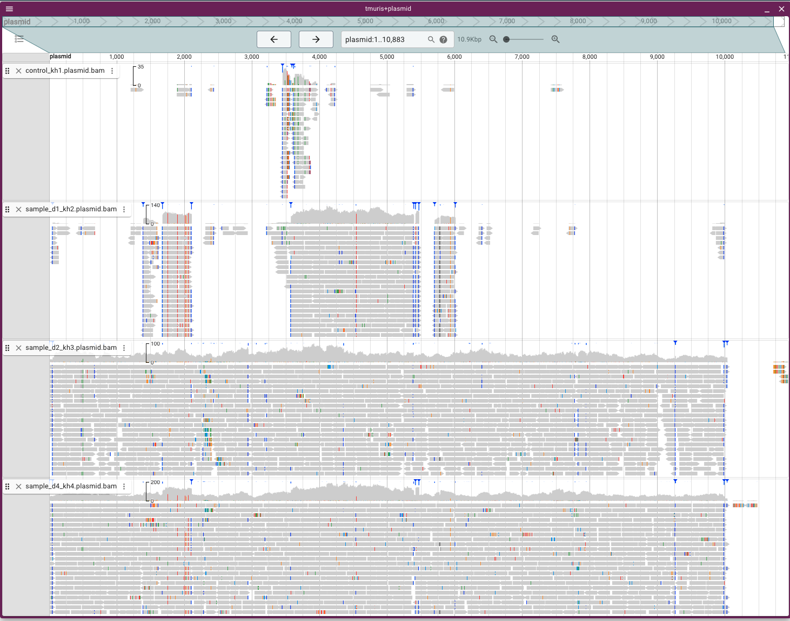

# Transgenesis of Trichuris muris

- in collaboration with Richard Grencis' group at the University fo Manchester


- Background:
    - protocol and informatics processing: https://www.ncbi.nlm.nih.gov/pmc/articles/PMC4829050/
    - sequencing data: https://www.ebi.ac.uk/ena/browser/view/PRJEB53152

- Samples
    - 6881STDY12870367	sample1 - D1	ERR10822048
    - 6881STDY12870368	sample2 - L1	ERR10822049
    - 6881STDY12870369	sample3 -Tm	ERR10822050
    - 6881STDY12870370	sample4 - t	ERR10822051
    - 6881STDY12870371	sample5 - D2	ERR10822052
    - 6881STDY12870372	sample6 - D4	ERR10822053

- where:
    - S1: Plasmid transfected L1
    - S2: Plasmid transfected cells (mammalian) – positive control for integration
    - S3: Trichuris DNA – negative control
    - S4: 2nd plasmid transfected ells (mammalian) – positive control for integration
    - S5: 2nd plasmid transfected L1
    - S6: 3rd plasmid transfected L1
    - Samples 1, 5,6 are the test samples, all done on different days and DNA taken form lots of worms (couldn’t pick out singly positive worms) and all samples positive for plasmid by PCR. As there are multiple worms and this was done multiple times it is likely that there will be multiple integration sites into the genome (fingers crossed the process worked) as lentivirus is randomly integrated.

### get data and references
```bash
# download data from ENA using wget
wget ftp://ftp.sra.ebi.ac.uk/vol1/fastq/ERR108/048/ERR10822048/ERR10822048_1.fastq.gz
wget ftp://ftp.sra.ebi.ac.uk/vol1/fastq/ERR108/048/ERR10822048/ERR10822048_2.fastq.gz
wget ftp://ftp.sra.ebi.ac.uk/vol1/fastq/ERR108/049/ERR10822049/ERR10822049_1.fastq.gz
wget ftp://ftp.sra.ebi.ac.uk/vol1/fastq/ERR108/049/ERR10822049/ERR10822049_2.fastq.gz
wget ftp://ftp.sra.ebi.ac.uk/vol1/fastq/ERR108/050/ERR10822050/ERR10822050_1.fastq.gz
wget ftp://ftp.sra.ebi.ac.uk/vol1/fastq/ERR108/050/ERR10822050/ERR10822050_2.fastq.gz
wget ftp://ftp.sra.ebi.ac.uk/vol1/fastq/ERR108/051/ERR10822051/ERR10822051_1.fastq.gz
wget ftp://ftp.sra.ebi.ac.uk/vol1/fastq/ERR108/051/ERR10822051/ERR10822051_2.fastq.gz
wget ftp://ftp.sra.ebi.ac.uk/vol1/fastq/ERR108/052/ERR10822052/ERR10822052_1.fastq.gz
wget ftp://ftp.sra.ebi.ac.uk/vol1/fastq/ERR108/052/ERR10822052/ERR10822052_2.fastq.gz
wget ftp://ftp.sra.ebi.ac.uk/vol1/fastq/ERR108/053/ERR10822053/ERR10822053_1.fastq.gz
wget ftp://ftp.sra.ebi.ac.uk/vol1/fastq/ERR108/053/ERR10822053/ERR10822053_2.fastq.gz


# get trichuris muris genome assembly from wormbase parasite
wget https://ftp.ebi.ac.uk/pub/databases/wormbase/parasite/releases/WBPS18/species/trichuris_muris/PRJEB126/trichuris_muris.PRJEB126.WBPS18.genomic.fa.gz
gunzip trichuris_muris.PRJEB126.WBPS18.genomic.fa.gz

```


### mapping reads to the reference genome
```bash
# map samples to the reference genome
ls -1 *_1.fastq.gz | sed 's/_1.fastq.gz//g' | awk '{print $1,$1}' OFS="\t" > lanes_samples.list

./run_mapping.sh

```

tgtgactctggtaactagagatccctc


zcat ERR10822048_1.fastq.gz |  sed -n '2~4p' | head -n 1000000 | sort | uniq -c | sort -n | tail


@ERR10822048.1 MS3_45020:1:1114:8721:5555/1
CGATGTGAGATCCCTCAGACCCTTTTAG-TCAGTGTGGAAAATCTCTAGCAGGG-CCCTAAAAACATGACAAGAGGGAGGCGACACCTCGGCCGAACAAGCATGGTTAGGTAGGACCTTAACAACGAACTCGTTCAATTTTTCGCCTGTCTT
CGATGTGAGATCCCTCAGACCCTTTTAG-TCAGTGTGGAAAATCTCTAGCAGGG-CCCCTAGGCTGTTGAGGTAACACATTAGGTGGTTTAGGACGCAGTCTACGGTTAGTCCCTTAAGCGGAGGCCCTATAGTGAGTCGTATTACAGATCG
CGATGTGAGATCCCTCAGACCCTTTTAG-TCAGTGTGGAAAATCTCTAGCAGGG-CCCCTAGGCTGTTGAGGTATCACATTTGGTGGTTTAGGACGCAATATACGGTTAGTCCCTTTAGCGGAGGCCCTATAGTGAGTCGTATTACTAATCG
CGATGTGAGATCCCTCAGACCCTTTTAG-TCAGTGTGGAAAATCTCTAGCAGGG-CCCCTAGGCTGTTGACTTAACACGTTAGGTGTTATAGGACGCAATCTACGGTTAGTCCCTTAGGCGGGACCCCTCTCGTGAGTCTTATTACAGAGCG
CGATGTGAGATCCCTCAGACCCTTTTAG-TCAGTGTGGAAAATCTCTAGCAGGG-GCGCCCGGACGTGGACTTAAAATCTAAAGTGTTACAGGACGCACTCTCTGGTCAGAAGCCTCGGCGTGCTCAATCTCATACGGCAATTTACAAGGCG
+


@ERR10822048.1 MS3_45020:1:1114:8721:5555/2
GTAATACGACTCACTATAGGGC-CTCCGCTTAAGGGACTAA-AGACATCCCAAAAGTTGAACTAGAGCGATGTCAAATCCTCGCCCAACCCTGCGGATTCCTCCGACCTGTCTTCTACTGTCTGTCATGCTTTAAATTTTCTGCAATAGCTT
GTAATACGACTCACTATAGGGC-CTCCGCTTAAGGGACTAA-CCGTAGACTGCGTCCTAAACCACCTAATGTGTTACCTCAACAGCCTAGGGGCCCTGCTAGAGATTTTCCACACTGACTAAAAGGGTCTGAGGGATCTCACATCGAGATCG
GTAATACGACTCACTATAGGGC-CTCCGCTTAAGGGACTAA-CCGTAGATTGCGCCCTCAACCAACTAGTGTGTTACCTCAACCACCCCGGGATCCTGATAGAGATTTTCAGCACTAACTCAAAGAGTCTGAGGGACCTCGCATCGAGATCG
GTAATACGACTCACTATAGGGC-CTCCGCTTAAGGGACTAA-CCGTAGACTTCGCCCTCAGCCACCTAGTGTGTTACCTCACCAACCCCGAGATCCTGCTAGCGATTTTCCGCACTGGCTAATAGGTTCTGGTGGTTCTCGCATCATTATCG
GTAATACGACTCACTATAGGGC-CTCCGCTTAAGGGACTAA-CCGTAGATTGCGTCCTAAAACACCTAATGTGTTACCTCAATAGCCTAGAGGTCCTGCTAGAGATTTTCCACACTGACTAAAAGGGTCTGAGGGTTCTCACATCAAGATCG


samtools view ERR10822048.bam | cut -f10 | head
GTAATACGACTCACTATAGGGCCTCCGCTTAAGGGAC-TAACCGTAGACTGTGTCCTAAACCACCTAATGTGTTACCTCTATAGCCCAGAGGCCCTGCTAGAGATTTTCCACAATGACTTAAAGGGCCTGAGGGATCCCACATCAAGATCG
GTAATACGACTCACTATAGGGCCTCCGCTTAAGGGAC-TAACCGTAGACTGCGCCCTAAACCACCTAATGTGTTACCTCAACAGCCTAGGGGCCCTGCTAGAGATTTTCAACACTGACTAAAAGGGTTTGAGGGATCTCACATCGTTATCG
GTAATACGACTCACTATAGGGCCTCCGCTTAAGGGAC-TAACCGTAGACTGTGTCCTAAACCACCTAATGTGTTACCTCAACAGCCTAGGGGCCCTGCTAGAGACTTTCCACACTGACTAAAAGGGTCTGAGGGATCTCACATCGAGATCG
GTAATACGACTCACTATAGCGCCTCCGCTTAAGGGAC-TAACCGTAGACTGCTTCCTAAACCACCTAATGTGTTACCTCTACACCCCAGGAGCCCTGCTAGAGATTTTGCACACTGACTAAAATGGTCAGAAGGATCTCACATCTAGATCG
CGATCTGTAATACGACTCACTATAGGGCCTCCGCTTAAGGGAC-TAACCGTAGACTGCGTCCTAAACCACCAAATGTGTTACCTCAACAGCCTAGGGGCCCTGCTAGAGATTTTCCACACTGACTAAAAGGGTCTGAGGGATCTCACATCG
CGATCTGTAATACCACTCGCTATAGGGCCTACGCTTAAGGGAC-TAACCGTAGACTGCGACCTAAACCACCAAATGTGTTACCTCAACAGCCTAGGGGCCCTGCTAGAGATTTTCCACACTGACTAAAAGGGTCTGAGGGATCTCACATCG
CGATCTGTAATACGACTCACTATAGGGCCTCCGCTTAAGGGAC-TAACCGTAGCCTGCGTCCTAAACCACCTAATGTGTTACCTCAACAGCCTAGGGGCCCTGCTAGAGATTTTCCACACTGACTAAAAGGGTCTGAGGGATCTCACATCG
CGATCTGTAATACGACTCACTATAGGGGCTCCGGTTAAGGGAC-TAACCGTAGACTGTGACCTAAACCACCTAATGTGTTACCTAAAAAGCACAGGGGCCCTGCTAGAGATTTTCCACACTGACTAAAAGGGTCTGAGGGATCTCACATCG
CGATCTGTAATACGACGCACTATAGGGCAGCCACTTAAGGGAC-TAACCGTGGACTGCGTCCTAAACCACCTAATGTGTTACCTCAGAAGCCCACGGGCCCTGCTAGAGATTTTCCACACTGACTAAAAGGGTCTGAGGGATCTCACATCG
CGATCTGTAATACGACTCACTATAGGGCCTCCGCTTAAGGGAC-TAACCGTAGACTGCGTCATAAACCACCTAATGTGTTACCTCAACAGCCAAGGGGCCCTGCTAGAGATTTTCCACACTGACTAAAAGGGTCTGAGGGATCTCACATCG


# creating sequnence logo of first 20 bp of trichuris sequennce
samtools view ERR10822048.bam | cut -f10  | sort | uniq | grep "GTAATACGACTCACTATAGGGCCTCCGCTTAAGGGAC" | sed 's/^.*GTAATACGACTCACTATAGGGCCTCCGCTTAAGGGAC//g' | sed 's/TGCTAGAGATTTTCC.*$//g' | cut -c-20 | sort | uniq -c | sort -n | awk '{if(length($2)==20) print $2}'


zcat ERR10822048_1.fastq.gz | grep -c "@ERR10822048" | head
>> 1583841 reads 

zcat ERR10822048_1.fastq.gz | grep -c "CTCCGCTTAAGGGACTAA" | head
>> 0 reads 

zcat ERR10822048_2.fastq.gz | grep -c "CTCCGCTTAAGGGACTAA" | head
>> 757690 reads with linker and RD site - linker only found in read 2 - means the assay is directional when sequneced

zcat ERR10822048_2.fastq.gz | grep -c "CTCCGCTTAAGGGAC" | head
>> 1472806 reads - more reads when RD site missing


zcat ERR10822048_1.fastq.gz | grep -c "TTAGTCCCTTAAGCGGAGG" | head
>> 360020 reads with linker in RC with RD - only found in read 1, not in read 2

zcat ERR10822048_1.fastq.gz | grep -c "GTCCCTTAAGCGGAGG" | head
>> 956483  reads with linker in RC but with no RD - only found in read 1, not in read 2

So there is a good proportion of reads with no restriction site 


zcat ERR10822048_2.fastq.gz | grep "CTCCGCTTAAGGGACTAA" | grep "TGCTAGAGATTTTCC" | wc -l
>> 459873 reads with both linker and LTR sequences


zcat ERR10822048_1.fastq.gz | grep "GACCCTTTTAGTCAG" | grep "TTAGTCCCTTAAGCGG" | wc -l
>> 354000

zcat ERR10822048_1.fastq.gz | grep "GAGATCCCTCAGACCCTTTTAGTCAG" | grep "TTAGTCCCTTAAGCGGAGGCCC" | wc -l
>> 337669


zcat ERR10822048_2.fastq.gz | grep "GTAATACGACTCACTATAGGGCCTCCGCTTAAGGGAC" | grep "CTGACTAAAAGGGTCTGAGGGATCTC" | wc -l
>> 880055 reads with both linker, LTR , but no RD site

zcat ERR10822048_2.fastq.gz | grep "GTAATACGACTCACTATAGGGCCTCCGCTTAAGGGACTAA" | grep "CTGACTAAAAGGGTCTGAGGGATCTC" | wc -l
>> 319454 reads with both linker, LTR and RD site

zcat ERR10822048_1.fastq.gz | grep "GAGATCCCTCAGACCCTTTTAGTCAG" | grep "GTCCCTTAAGCGGAGGCCCTATAGTGAGTCGTATTAC" | wc -l
>> 864882 reads with both linker, LTR , but no RD site

zcat ERR10822048_1.fastq.gz | grep --colour "GAGATCCCTCAGACCCTTTTAGTCAG" | grep --colour "TTAGTCCCTTAAGCGGAGGCCCTATAGTGAGTCGTATTAC" | wc -l
>> 316316 reads with both linker, LTR and RD site


for i in *_1.fastq.gz; do echo $i ; zcat $i | grep "GAGATCCCTCAGACCCTTTTAGTCAG" | grep "TTAGTCCCTTAAGCGGAGGCCC" | wc -l; done
ERR10822048_1.fastq.gz
337669
ERR10822049_1.fastq.gz
136833
ERR10822050_1.fastq.gz
261272
ERR10822051_1.fastq.gz
33863
ERR10822052_1.fastq.gz
217562
ERR10822053_1.fastq.gz
231912

for i in *_2.fastq.gz; do echo $i ; zcat $i | grep "GTAATACGACTCACTATAGGGCCTCCGCTTAAGGGACTAA" | grep "CTGACTAAAAGGGTCTGAGGGATCTC"  | wc -l; done
ERR10822048_2.fastq.gz
319454
ERR10822049_2.fastq.gz
113456
ERR10822050_2.fastq.gz
191552
ERR10822051_2.fastq.gz
30504
ERR10822052_2.fastq.gz
164190
ERR10822053_2.fastq.gz
191632


for i in *_1.fastq.gz; do 
    echo $i ; zcat $i |\
     grep "GAGATCCCTCAGACCCTTTTAGTCAG" | grep "TTAGTCCCTTAAGCGGAGGCCC" |\
     sed 's/^.*GAGATCCCTCAGACCCTTTTAGTCAG//g' | sed 's/TTAGTCCCTTAAGCGGAGGCCC.*$//g' |\
     sort | uniq -c | wc -l; done


ERR10822053_1.fastq.gz

for i in ERR10822053_1.fastq.gz; do 
    echo $i ; zcat $i |\
     grep "GAGATCCCTCAGACCCTTTTAGTCAG" | grep "TTAGTCCCTTAAGCGGAGGCCC" |\
     sed 's/^.*GAGATCCCTCAGACCCTTTTAGTCAG//g' | sed 's/TTAGTCCCTTAAGCGGAGGCCC.*$//g' |\
     sort | uniq -c ; done


Sequence preference
for i in ERR10822052_1.fastq.gz; do      echo $i ; zcat $i |     grep "GAGATCCCTCAGACCCTTTTAGTCAG" | grep "TTAGTCCCTTAAGCGGAGGCCC" |     sed 's/^.*GAGATCCCTCAGACCCTTTTAGTCAG//g' | sed 's/TTAGTCCCTTAAGCGGAGGCCC.*$//g' |     sort | uniq -c ; done | sort -n

ERR10822048_1.fastq.gz
TGTGGAAAATCTCTAGCAGGGCCC

ERR10822049_1.fastq.gz
TGTGGAAAATCTCTAGCA

ERR10822050_1.fastq.gz
TGTGGAAAATCTCTAGCAGGGCCC

ERR10822051_1.fastq.gz
TGTGGAAAATCTCTAGCA

ERR10822052_1.fastq.gz
TGTGGAAAATCTCTAGCAGGGCCC

ERR10822053_1.fastq.gz
TGTGGAAAATCTCTAGCAGGGCCC


### length of insert between LTR and linker primers
```bash
for i in *_1.fastq.gz; do 
    zcat $i |  grep "GAGATCCCTCAGACCCTTTTAGTCAG" | grep "TTAGTCCCTTAAGCGGAGGCCC" | sed 's/^.*GAGATCCCTCAGACCCTTTTAGTCAG//g' | sed 's/TTAGTCCCTTAAGCGGAGGCCC.*$//g' | awk -v i=${i%_1.fastq.gz} '{if(length>=0) print i,"R1",length }' OFS="\t" ; 
    done > length.histo

for i in *_2.fastq.gz; do 
    zcat $i | grep "GGGCCTCCGCTTAAGGGACTAA" | grep "CTGACTAAAAGGGTCTGAGGGATCTC"  | sed 's/^.*GGGCCTCCGCTTAAGGGACTAA//g' | sed 's/CTGACTAAAAGGGTCTGAGGGATCTC.*$//g' | awk -v i=${i%_2.fastq.gz} '{if(length>=0) print i,"R2",length }' OFS="\t" ; 
    done >> length.histo


```R
library(tidyverse)

data <- read.table("length.histo", header=F)

ggplot(data, aes(V3)) + 
    geom_histogram(binwidth=1) +
    facet_grid(V1~V2, scales="free_y") + 
    labs(x="Distance between LTR and linker sites (bp)")

```


### scaffolds with exact hits to LTR and linkers
```bash
samtools view ERR10822050.bam | grep --color=always "TTAGTCCCTTAAGCGGAGGCCC\|GGGCCTCCGCTTAAGGGACTAA" | grep --color=always  "GAGATCCCTCAGACCCTTTTAGTCAG\|CTGACTAAAAGGGTCTGAGGGATCTC" | cut -f3 | sort | uniq -c
```


### Identifying reads with linker sequences
- select reads that have both LTR and adaptor sequences, trim them, and then map them
- filtered for good mapping qualities, unique mapping
- selecting sites with at least 100 reads

```bash
module load cutadapt/1.15--py36_0

cd /nfs/users/nfs_s/sd21/lustre_link/trichuris_muris/TRANSGENESIS

for i in ERR10822048 \
ERR10822049 \
ERR10822050 \
ERR10822051 \
ERR10822052 \
ERR10822053; do 

cutadapt --quiet --trimmed-only -g GAGATCCCTCAGACCCTTTTAGTCAG ${i}_1.fastq.gz | cutadapt  --quiet --trimmed-only -a TTAGTCCCTTAAGCGGAGGCCCTATAGTGAGTCGTATTAC - > ${i}.trimmed.fastq

cutadapt --quiet --trimmed-only -g GTAATACGACTCACTATAGGGCCTCCGCTTAAGGGACTAA ${i}_2.fastq.gz | cutadapt --quiet --trimmed-only -a CTGACTAAAAGGGTCTGAGGGATCTC - >> ${i}.trimmed.fastq

minimap2 -x sr trichuris_muris.PRJEB126.WBPS18.genomic.fa ${i}.trimmed.fastq  > ${i}.tm.minimap.paf
minimap2 -a -x sr trichuris_muris.PRJEB126.WBPS18.genomic.fa ${i}.trimmed.fastq | samtools sort -o ${i}.tm.minimap.bam --write-index -

minimap2 -x sr GRCh38_latest_genomic.fna ${i}.trimmed.fastq  > ${i}.hs.minimap.paf
minimap2 -a -x sr GRCh38_latest_genomic.fna ${i}.trimmed.fastq | samtools sort -o ${i}.hs.minimap.bam --write-index -


awk '{if($12>=50) print }' ${i}.tm.minimap.paf | cut -f6,8 | sort | uniq -c | awk '{if($1>=100) print}' OFS="\t" | sort -k2,2 -k3,3n > ${i}.insertion.coords
awk '{if($12>=50) print }' ${i}.hs.minimap.paf | cut -f6,8 | sort | uniq -c | awk '{if($1>=100) print}' | sort -k2,2 -k3,3n >> ${i}.insertion.coords;
done


# generate a filtered set of paf data for plotting.
for i in *tm.minimap.paf; do 
    awk '{if($12>=50) print}' > ${i%paf}filtered.paf; 
    done
```


samtools faidx trichuris_muris.PRJEB126.WBPS18.genomic.fa
cat trichuris_muris.PRJEB126.WBPS18.genomic.fa.fai | grep "TMUE_LG" | sort | cut -f1,2 > tmuris.genome

bedtools makewindows -g tmuris.genome -w 10000 > tmuris.genome.10k.bed

for i in *.tm.minimap.filtered.paf; do
    cat ${i} | cut -f6,8,9 > ${i%.paf}.bed
    bedtools coverage -a tmuris.genome.10k.bed -b ${i%.paf}.bed > ${i%.paf}.10k.counts
    awk -v name=${i%.tm.minimap.filtered.paf} '{print name, $0}' OFS="\t" ${i%.paf}.10k.counts > tmp; mv tmp ${i%.paf}.10k.counts ; 
done

cat *.10k.counts > data.10k.counts

```R
library(tidyverse)

data <- read.table("data.10k.counts", header=F)

ggplot(data, aes(V3, log(V5))) + geom_point() + facet_grid(V1~V2)

```


@ERR10822050.155617 MS3_45020:1:1101:16003:2069/1
CGATGTGAGATCCCTCAGACCCTTTTAGTCAG TGTGGAAAATCTCTAGC AGGGCCCCTGTTGGGAATCACTGGAGTTGAGGCTGATTTCATAACTGAATTACCGGTGAGTGCGAATCCAACTGAAATGATTCACTTTAGTCCCTTAAGCG


ERR10822050.155617
AGTGAATCATTTCAGTTGGATTCGCACTCACCGGTAATTCAGTTATGAAATCAGCCTCAACTCCAGTGATTCCCAACAGGGGCCCT GCTAGAGATTTTCCACA


# WGS

## Raw data
- sequencing was performed in Manchester (?) and then transferred to Sanger
- they provided a download script "download_fastqs.py" to automate the transfer

```bash
# downloaded files
KH1_S21_R1_001.fastq.gz
KH1_S21_R2_001.fastq.gz
KH2_S22_R1_001.fastq.gz
KH2_S22_R2_001.fastq.gz
KH3_S23_R1_001.fastq.gz
KH3_S23_R2_001.fastq.gz
KH4_S24_R1_001.fastq.gz
KH4_S24_R2_001.fastq.gz

```
- sample names to experiment names 
    - control_kh1
    - sample_d1_kh2
    - sample_d2_kh3
    - sample_d4_kh4

- to prepare for mapping, made a sample manifest

```bash
# sample manifest - "sample_manifext.txt"
ID,R1,R2
control_kh1,/nfs/users/nfs_s/sd21/lustre_link/trichuris_muris/TRANSGENESIS/WGS/KH1_S21_R1_001.fastq.gz,/nfs/users/nfs_s/sd21/lustre_link/trichuris_muris/TRANSGENESIS/WGS/KH1_S21_R2_001.fastq.gz
sample_d1_kh2,/nfs/users/nfs_s/sd21/lustre_link/trichuris_muris/TRANSGENESIS/WGS/KH2_S22_R1_001.fastq.gz,/nfs/users/nfs_s/sd21/lustre_link/trichuris_muris/TRANSGENESIS/WGS/KH2_S22_R2_001.fastq.gz
sample_d2_kh3,/nfs/users/nfs_s/sd21/lustre_link/trichuris_muris/TRANSGENESIS/WGS/KH3_S23_R1_001.fastq.gz,/nfs/users/nfs_s/sd21/lustre_link/trichuris_muris/TRANSGENESIS/WGS/KH3_S23_R2_001.fastq.gz
sample_d4_kh4,/nfs/users/nfs_s/sd21/lustre_link/trichuris_muris/TRANSGENESIS/WGS/KH4_S24_R1_001.fastq.gz,/nfs/users/nfs_s/sd21/lustre_link/trichuris_muris/TRANSGENESIS/WGS/KH4_S24_R2_001.fastq.gz


```


## Reference
- want to map to both the T. muris genome and the transgenesis plasmid
- ideally, want to find reads that map in both the plasmid and the genome, which will show intergration sites
- however, evidence of sequencing coverage on the plasmid genome alone is pretty good evidence of integration

```bash
# muris genome - from WBPS v18
ln -s ../trichuris_muris.PRJEB126.WBPS18.genomic.fa

# transgenesis plasmid genome from Kelly
transgenesis_plasmid.fa

cat trichuris_muris.PRJEB126.WBPS18.genomic.fa transgenesis_plasmid.fa > tm_genome_plus_plasmid.fa

```

## mapping 
```bash

module load mapping-helminth/v1.0.8

mapping-helminth --input sample_manifext.txt --reference trichuris_muris.PRJEB126.WBPS18.genomic.fa --outdir tmuris_transgenesis_wgs_mapping

```


## Coverage
```bash
# collect the bam files
cd /nfs/users/nfs_s/sd21/lustre_link/trichuris_muris/TRANSGENESIS/WGS

OUTPUT_DIR=/nfs/users/nfs_s/sd21/lustre_link/trichuris_muris/TRANSGENESIS/WGS/COVERAGE
find ~+ -type f -name '*.bam*' -exec ln -vs "{}" $OUTPUT_DIR/ ';'

cd /nfs/users/nfs_s/sd21/lustre_link/trichuris_muris/TRANSGENESIS/WGS/COVERAGE

# calculate coverage of the bams
bsub.py 10 cov_stats "~sd21/bash_scripts/run_cov_stats 10000"


# extract mean coverage of the chromosome and plasmid, and calculate the ratio of the two
echo -e "name\tchromosome_cov\tplasmid_cov\tratio" > chromosome_to_plasmid_cov.stat
for i in *.chr.cov; do
     name=${i%.chr.cov};
     chromosome=$(grep "TMUE_LG1\|TMUE_LG2\|TMUE_LG3" ${i} | datamash mean 5 );
     plasmid=$(grep "plasmid" ${i} | datamash mean 5);
     ratio=$(echo "scale=3; ${plasmid}/${chromosome}" | bc);
     echo -e "${name}\t${chromosome}\t${plasmid}\t${ratio}";
done >> chromosome_to_plasmid_cov.stat

```
| name          | chromosome_cov  | plasmid_cov | ratio |
|---------------|-----------------|-------------|-------|
| control_kh1   | 341.187         | 0.486406    | .001  |
| sample_d1_kh2 | 292.493         | 13.3445     | .045  |
| sample_d2_kh3 | 321.883         | 27.6059     | .085  |
| sample_d4_kh4 | 325.63766666667 | 49.4403     | .151  |


# reads with both plasmid and worm sequence
- reads that span the plasmid and the worm will inform integration sites
- could be R1 in plasmid and R2 in worm, and vice versa 
- note that because the integration is random, and the sequence was performed on DNA from a pool, integration sites might be extremely low coverage - even single reads
- also note - the hits between WGS and amplicon experiements might not be concordant - the amplicon sequencing is only sampling a fraction of integration sites that meet the criteria - ie have restriction sites near to integration sites

```bash
# extract lines in bams with both plasmid and TMUE in the line - should pick up paired reads, one in the worm and one in plasmid

for i in *.bam; do
    samtools view ${i} | grep "plasmid" | grep "TMUE" > ${i%bam}.plasmid-worm.hits;     
    done

wc -l *plasmid-worm.hits
#    0 control_kh1..plasmid-worm.hits
#   19 sample_d1_kh2..plasmid-worm.hits
#   24 sample_d2_kh3..plasmid-worm.hits
#   31 sample_d4_kh4..plasmid-worm.hits
```
- very few hits in total - perhaps expected
- none in the control, which is good
- most hits not in the chromosomes, which is unfortunate
- most hits are split to some degree, which might be expected if spanning a integration site, but also might be non-specific


## extract plasmid reads for visualisation
```bash

for i in *bam; do 
    samtools view --bam -o ${i%.bam}.plasmid.bam ${i} plasmid;
    samtools index ${i%.bam}.plasmid.bam;
    done

```
- screenshot over coverage from jBrowse
